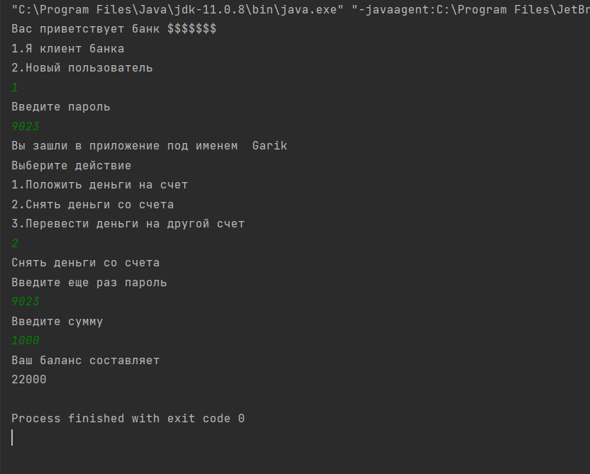
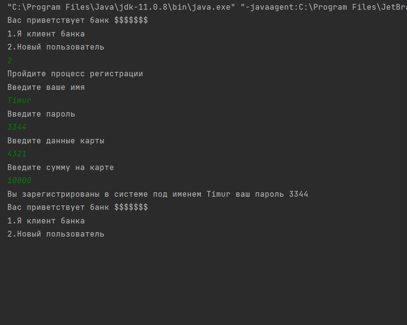
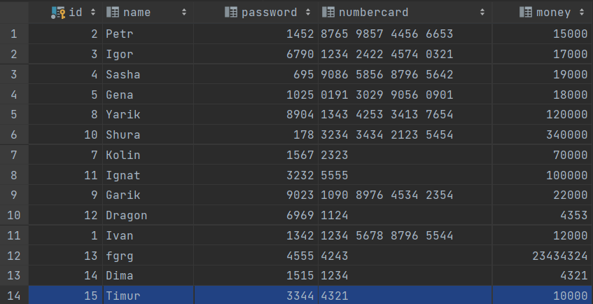

# ATM 
- This application works in console.We can withdraw , put, transfer money. We launch project

- We entered how current client and withdraw money.
- Now we create new client  :

- Our new client  appeared in table

