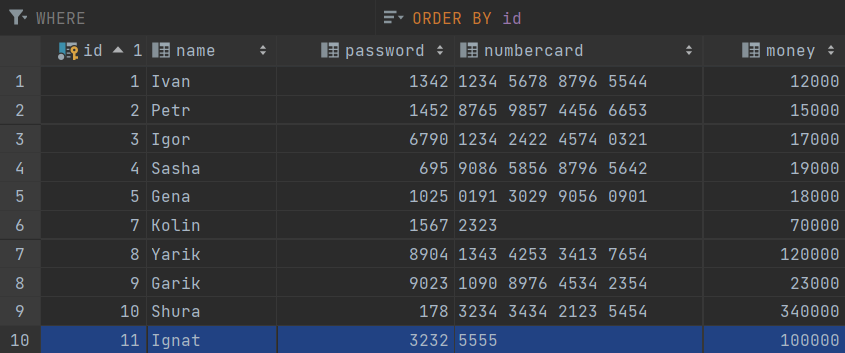

# ATM 
- This application works in console. We launch project and we see main menu:

Вас приветствует банк $$$$$$$

1.Я клиент банка

2.Новый пользователь

- For example we choose number 2:

Пройдите процесс регистрации

Введите ваше имя

Ignat

Введите пароль

3232

Введите сумму на карте

100000

- Our new client  appeared in table

